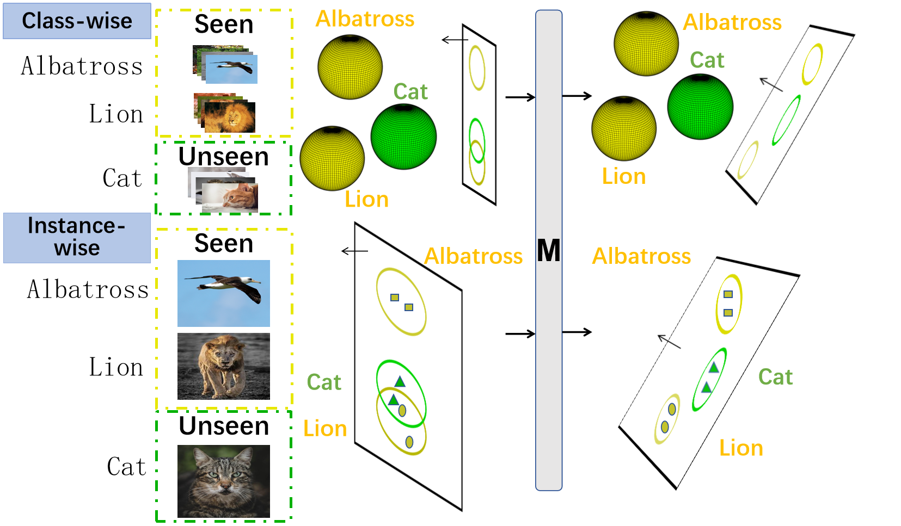
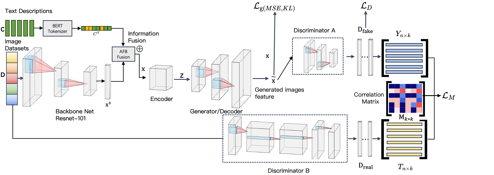
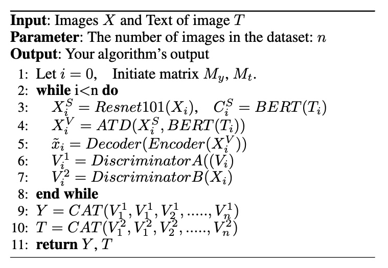
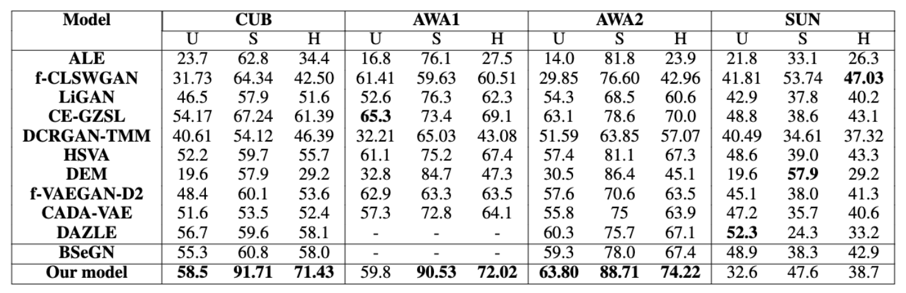

# Metric Learning Compensating for Projection Bias of Generalized Zero-shot Learning 
(Already submit to AAAI2024)

We work from 2023.5.19 to 2023.8.16 and get a satisfied result.

**Comprehensive evaluation benchmarks on four datasets demonstrate the superiority of our method over the state-of-the-art counterparts.**

## Environments
- Ubuntu / MacOS
- Python = 3.9
- Torch = 2.0.1
- Numpy = 1.25.0
- Pandas = 1.5.3
- Huggingface_hub = 0.16.4
- Pillow = 9.4.0
- Torchvision = 0.15.2
- Transformer = 4.31.0

## Dataset
1. CUB dataset: downloading the [birds](http://www.vision.caltech.edu/visipedia/CUB-200-2011.html) image data. 
2. AWA1 dataset: downloading the [Animal1](https://cvml.ista.ac.at/AwA/) image data. 
2. AWA2 dataset: downloading the [Animal2](https://cvml.ista.ac.at/AwA2/) image data. 

## Abstract

Generalized zero-shot learning models (GZSL) aim to recognize samples from seen or unseen classes using only samples from seen classes as training data. During inference, GZSL methods are often biased towards seen classes due to the visibility of seen class samples during training. Most current GZSL methods try to learn an accurate projection function (from visual space to semantic space) to avoid bias and ensure the effectiveness of GZSL methods. However, during inference, the computation of distance will be important when we classify the projection of any sample into its nearest class, even though we learn a biased projection function in the model. In our work, we attempt to learn a parameterized Mahalanobis distance within the framework of VAEGAN (Variational Autoencoder \& Generative Adversarial Networks), where the weight matrix depends on the network's output. In particular, we improved the network structure of VAEGAN to leverage the discriminative models of two branches to separately predict the real samples and the fake samples generated by this real one. We proposed a new loss function with them to help us learn the optimized Mahalanobis distance representation. Comprehensive evaluation benchmarks on four datasets demonstrate the superiority of our method over the state-of-the-art counterparts.
  

## Problem Statement

To compensate for the imbalanced classification problems, our method has been adopted to generate samples (i.e. images or visual features) for unseen classes by leveraging their semantic representations. In addition to the issue of semantic imbalance, we have observed instance shift problems in zero-shot learning. Instance shift refers to the significant differences among instances within the same class. For example, substantial variations exist among bird instances of the same class in the CUB dataset. Our model aims to solve the two shifting problems. We must also solve the redundancy problem of previous VAE and GAN structures and the semantic imbalance. We introduced a dual learning framework that utilises CVAE and CGAN with an added classifier to generate more distinctive visual features for unseen classes. But this structure is unnecessary, so we devised a unique VAEGAN.

## Brief Description of Our Proposed Method

### <u>Illustration of the Overall Scheme</u>

### <u> Algorithms </u>

&nbsp

## Implementation Details
Regarding basic visual features and visual extraction, we utilize the pre-trained Resnet101 and Bert to extract the images' visual and semantic features and generate a visual feature vector (1 * 1000) and a semantic feature vector (1 * 768), respectively. These two vectors can be catted and converted linearly into a (1 * 3 * 256 * 256) vector to train a joint representation of images and texts. The images' fused visual and semantic feature vectors are further processed using a VAE (Variational Autoencoder) architecture to obtain a new latent feature vector. Finally, the obtained latent feature vector is fed through Discriminator A, resulting in a (1 * 900) dimensional vector. In the second stage, the image vector goes through Discriminator B and gets a (1 * 900) dimensional vector like stage 1. Our implementation is achieved by PyTorch and optimized by ADAM optimizer. We set the learning rate as 1e-3. 

## Experimental Results 

## Guidelines for Codes

### Training

Download training dataset CUB and put it in CUB_dataset

run run-on-cpu-server.sh

### Test

run Eval.py
